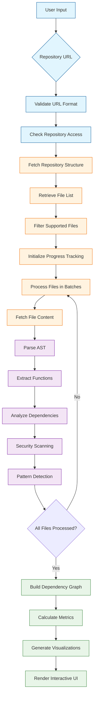
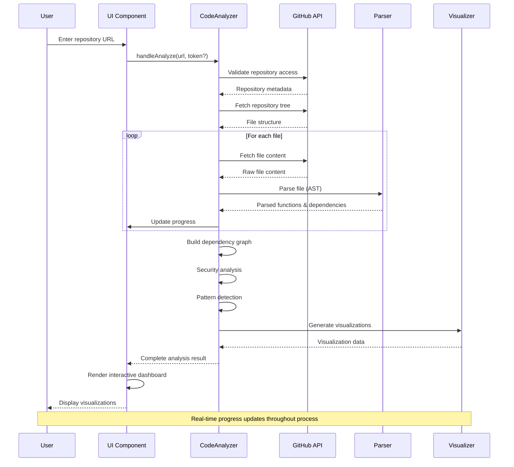
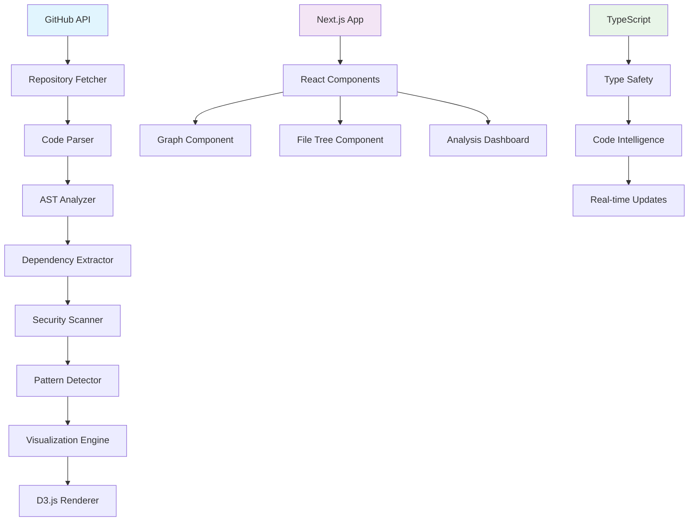

<div align="center">

# Vericode

### Visualize Your Codebase Architecture in Real-Time

**Zero setup. No installation. Just paste a GitHub URL.**

[](https://opensource.org/licenses/MIT)
[](https://nextjs.org/)
[](https://www.typescriptlang.org/)

[Try it Now](https://vericode.vercel.app/) · [Report Bug](https://github.com/yourusername/vericode/issues) · [Request Feature](https://github.com/yourusername/vericode/issues)


</div>

---

## Why Vericode?

Ever opened a new codebase and felt completely lost? **Vericode** transforms any GitHub repository into an interactive architecture visualization in seconds, helping developers understand complex codebases instantly.

- **No installation required** — runs entirely in your browser
- **No data collection** — your code never leaves your machine
- **No accounts** — just paste a URL and analyze
- **Real-time analysis** — see results as they process
- **Multiple visualization modes** — graph, treemap, tree, flow, cluster, and bundle views

```
⚡ Paste URL → Real-time Analysis → Interactive Visualization → Better Code Decisions
```

---

## Features

### Interactive Dependency Graph
Explore how your files connect through an interactive force-directed graph. Click any node to highlight its dependencies, drag to reposition, and zoom to focus on specific areas.

### Multi-View Architecture Visualization
Choose from multiple visualization perspectives:
- **Graph View**: Force-directed dependency relationships
- **Treemap**: Hierarchical file size and structure visualization
- **Tree View**: Traditional hierarchical file tree
- **Flow Diagram**: Data flow and function call relationships
- **Cluster Analysis**: Automatic code clustering by functionality
- **Bundle Analysis**: Import/export relationship mapping

### Real-Time Analysis Pipeline
Watch your codebase being analyzed in real-time with live progress updates:
- Repository validation and structure parsing
- AST-based function and dependency extraction
- Security vulnerability scanning
- Pattern detection and architectural analysis
- Performance metrics calculation

### Advanced Code Intelligence
- **Security Scanner**: Automated detection of hardcoded secrets, SQL injection vulnerabilities, and unsafe code patterns
- **Pattern Recognition**: Identification of design patterns, anti-patterns, and architectural violations
- **Health Metrics**: Code quality scoring based on coupling, complexity, and maintainability
- **Activity Analysis**: File coloring by commit frequency and development activity

### Developer Experience
- **File Tree Navigation**: Browse repository structure with syntax-highlighted file previews
- **Color Coding Options**: Layer-based, folder-based, or activity-based node coloring
- **Responsive Design**: Optimized for both desktop and mobile analysis
- **Export Capabilities**: JSON, Markdown, and visualization exports for documentation

## Analysis Workflow



---

## Privacy First

**Your code stays on your machine.** Vericode:

- ✅ Runs 100% in the browser using Next.js and client-side processing
- ✅ Makes API calls directly from your browser to GitHub
- ✅ Never stores your code or authentication tokens
- ✅ Works with private repositories (just add your token locally)
- ✅ No analytics, tracking, or data collection

Your GitHub token (if used) is only stored in your browser's memory and is cleared when you close the tab.

---

## Quick Start

### Option 1: Use Online (Recommended)
Visit [Vericode](https://vericode.vercel.app/) and paste any GitHub repository URL.

### Option 2: Run Locally
```bash
# Clone the repository
git clone https://github.com/yourusername/vericode.git

# Install dependencies
npm install

# Start development server
npm run dev
```

Open [http://localhost:3000](http://localhost:3000) to access the application.

### Option 3: Build for Production
```bash
# Build the application
npm run build

# Start production server
npm start
```

---

## Usage

### Public Repositories
```
Just paste: facebook/react
Or full URL: https://github.com/facebook/react
```

### Private Repositories
1. Create a [GitHub Personal Access Token](https://github.com/settings/tokens) with `repo` scope
2. Paste it in the token field during analysis
3. Analyze your private repositories securely

### Analysis Process
1. **Input Validation**: Repository URL format and accessibility check
2. **Repository Fetching**: Secure API calls to retrieve file structure and content
3. **Code Parsing**: AST-based analysis of supported programming languages
4. **Dependency Mapping**: Function call and import relationship extraction
5. **Visualization Generation**: Interactive graph rendering with D3.js
6. **Intelligence Analysis**: Security scanning and pattern detection



### Export Options
After analysis, export your results in multiple formats:
- **JSON Export**: Complete analysis data for programmatic use
- **Markdown Report**: Human-readable documentation format
- **Visualization Data**: Graph data for external tools

---

## Supported Languages

Vericode performs AST-based analysis and dependency extraction for:

| Language | Extensions | Parser |
|----------|------------|---------|
| JavaScript | `.js`, `.jsx` | Acorn-based AST |
| TypeScript | `.ts`, `.tsx` | TypeScript Compiler API |
| Python | `.py` | Python AST |
| Java | `.java` | Tree-sitter |
| Go | `.go` | Go AST |
| Rust | `.rs` | Rust Analyzer |
| C/C++ | `.c`, `.cpp`, `.h` | Tree-sitter |
| C# | `.cs` | Roslyn |
| PHP | `.php` | PHP Parser |

---

## Visualization Modes

```mermaid
stateDiagram-v2
    [*] --> Graph: Default View
    Graph --> Treemap: Switch Mode
    Graph --> Tree: Switch Mode
    Graph --> Flow: Switch Mode
    Graph --> Cluster: Switch Mode
    Graph --> Bundle: Switch Mode

    Treemap --> Graph: Switch Mode
    Tree --> Graph: Switch Mode
    Flow --> Graph: Switch Mode
    Cluster --> Graph: Switch Mode
    Bundle --> Graph: Switch Mode

    state Graph as "Graph View\n• Force-directed layout\n• Interactive node dragging\n• Dependency highlighting\n• Zoom & pan controls"
    state Treemap as "Treemap View\n• Hierarchical rectangles\n• Size-based file visualization\n• Color-coded directories\n• Space-efficient layout"
    state Tree as "Tree View\n• Traditional hierarchy\n• Expandable nodes\n• File type icons\n• Directory navigation"
    state Flow as "Flow View\n• Data flow diagrams\n• Function call chains\n• Process workflows\n• Connection routing"
    state Cluster as "Cluster View\n• Automatic grouping\n• Similarity analysis\n• Module boundaries\n• Architectural layers"
    state Bundle as "Bundle View\n• Import/export maps\n• Module dependencies\n• Bundle optimization\n• Dead code detection"

    note right of Graph
        Interactive force-directed graph
        showing file relationships and
        dependencies with real-time
        physics simulation
    end note

    note right of Treemap
        Hierarchical visualization using
        nested rectangles where size
        represents file importance and
        color shows categorization
    end note
```

| Mode | Description | Use Case |
|------|-------------|----------|
| **Graph** | Force-directed dependency relationships | Understanding complex interconnections |
| **Treemap** | Hierarchical file size and structure | Space utilization and file importance |
| **Tree** | Traditional hierarchical file tree | Navigation and directory structure |
| **Flow** | Data flow and function call relationships | Process workflows and data paths |
| **Cluster** | Automatic code clustering by functionality | Module identification and boundaries |
| **Bundle** | Import/export relationship mapping | Dependency optimization and bundling |

---

## Architecture



### Component Architecture

```mermaid
classDiagram
    class App {
        +state: AnalysisState
        +handleAnalyze()
        +handleSelectFile()
        +setColorMode()
        +setActiveVizTab()
    }

    class AnalyzePage {
        +repoUrl: string
        +loading: boolean
        +result: AnalysisResult
        +selectedFile: CodeFile
        +colorMode: ColorMode
        +activeVizTab: VizTab
        +renderDashboard()
    }

    class Graph {
        +nodes: Node[]
        +links: Link[]
        +colorMode: ColorMode
        +renderForceGraph()
        +handleNodeClick()
        +handleZoom()
    }

    class FileTree {
        +files: CodeFile[]
        +selectedFile: CodeFile
        +renderTree()
        +handleFileSelect()
    }

    class VizTreemap {
        +data: TreemapData
        +renderTreemap()
        +handleCellClick()
    }

    class VizTree {
        +treeData: TreeNode[]
        +renderTree()
        +handleNodeExpand()
    }

    class VizFlow {
        +flowData: FlowNode[]
        +renderFlow()
        +handleConnectionClick()
    }

    class VizCluster {
        +clusters: Cluster[]
        +renderClusters()
        +handleClusterSelect()
    }

    class VizBundle {
        +bundleData: BundleNode[]
        +renderBundle()
        +handleBundleClick()
    }

    App --> AnalyzePage
    AnalyzePage --> Graph
    AnalyzePage --> FileTree
    AnalyzePage --> VizTreemap
    AnalyzePage --> VizTree
    AnalyzePage --> VizFlow
    AnalyzePage --> VizCluster
    AnalyzePage --> VizBundle

    class CodeAnalyzer {
        +analyzeGitHubRepo()
        +processFiles()
        +extractDependencies()
    }

    class GitHubFetcher {
        +fetchRepository()
        +fetchFileContent()
        +getRepositoryTree()
    }

    class Parser {
        +parseJavaScript()
        +parseTypeScript()
        +parsePython()
        +extractFunctions()
    }

    AnalyzePage --> CodeAnalyzer
    CodeAnalyzer --> GitHubFetcher
    CodeAnalyzer --> Parser

    classDef page fill:#e3f2fd,stroke:#1976d2
    classDef component fill:#f3e5f5,stroke:#7b1fa2
    classDef service fill:#fff3e0,stroke:#f57c00
    classDef visualization fill:#e8f5e8,stroke:#388e3c

    class App,AnalyzePage page
    class Graph,VizTreemap,VizTree,VizFlow,VizCluster,VizBundle visualization
    class FileTree component
    class CodeAnalyzer,GitHubFetcher,Parser service
```

**Technology Stack:**
- **Frontend**: Next.js 14, React 18, TypeScript 5.0
- **Visualization**: D3.js for interactive graphs and data visualization
- **Styling**: Tailwind CSS with custom design system
- **Code Analysis**: Custom AST parsers with language-specific optimizations
- **State Management**: React hooks with optimized re-rendering
- **Build System**: Next.js with SWC compiler for fast builds

---

## API Limits & Authentication

GitHub API has rate limits that affect analysis speed:
- **Without token**: 60 requests/hour (suitable for small repositories)
- **With Personal Access Token**: 5,000 requests/hour (recommended for larger analysis)
- **With GitHub App**: 5,000 requests/hour per installation (optimal for teams)

### Authentication Methods

#### Personal Access Token (PAT)
1. Create a [GitHub Personal Access Token](https://github.com/settings/tokens) with `repo` scope
2. Enter it in the application when prompted
3. Enables analysis of private repositories

#### GitHub App Authentication (Recommended for Teams)
1. Create a [GitHub App](https://github.com/settings/apps) with repository permissions
2. Install the app on your organization
3. Generate installation tokens as needed

---

## Development

### Project Structure
```
vericode/
├── app/                    # Next.js App Router
│   ├── analyze/           # Main analysis page
│   ├── globals.css        # Global styles
│   └── layout.tsx         # Root layout
├── components/            # React components
│   ├── graph.tsx         # D3.js visualization
│   ├── file-tree.tsx     # File browser
│   └── ui/               # Reusable UI components
├── lib/                  # Core business logic
│   ├── analyzer.ts       # Code analysis engine
│   ├── github.ts         # GitHub API client
│   ├── orchestrator.ts   # Analysis coordination
│   └── parser.ts         # AST parsing utilities
├── types/                # TypeScript definitions
└── public/               # Static assets
```

### Contributing

We welcome contributions! Here's how to get started:

1. Fork the repository
2. Create a feature branch: `git checkout -b feature/your-feature`
3. Make your changes with proper TypeScript types
4. Test locally: `npm run dev`
5. Run linting: `npm run lint`
6. Submit a pull request

### Development Commands
```bash
# Development server
npm run dev

# Build for production
npm run build

# Run linting
npm run lint

# Type checking
npm run type-check
```

---

## FAQ

**Q: How does Vericode work without a backend?**
> Vericode runs entirely in your browser using Next.js client-side rendering. It makes direct API calls to GitHub and processes all analysis locally.

**Q: Is my code safe?**
> Yes. Your code is fetched directly from GitHub to your browser. Nothing is sent to any external servers. The analysis happens entirely client-side.

**Q: Why is analysis slow for large repositories?**
> Large repositories require many API calls to fetch individual files. Using a GitHub token significantly increases rate limits and analysis speed.

**Q: How accurate is the dependency analysis?**
> Vericode uses AST parsing for high accuracy, but may miss some dynamic imports or complex dependency patterns. It's designed for architectural overview rather than 100% static analysis.

**Q: Can I analyze private repositories?**
> Yes, by providing a GitHub Personal Access Token with `repo` scope. The token is only used client-side and never stored on any servers.

---

## License

MIT License — use it however you want.

---

<div align="center">

**Built with Next.js and TypeScript for developers, by developers**

*Stop guessing. Start understanding.*

</div>
